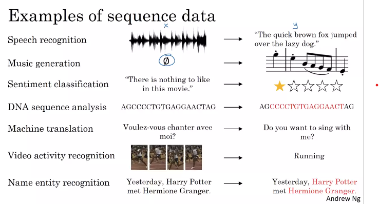
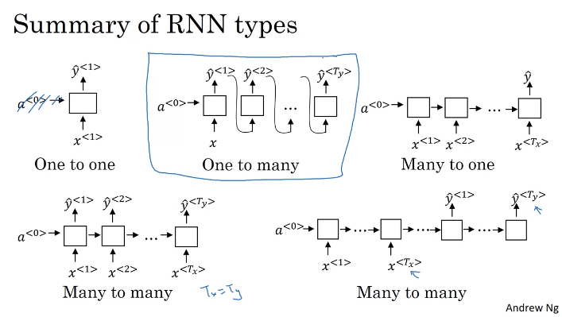
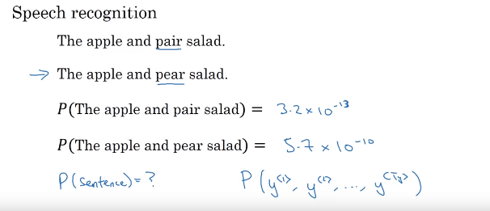
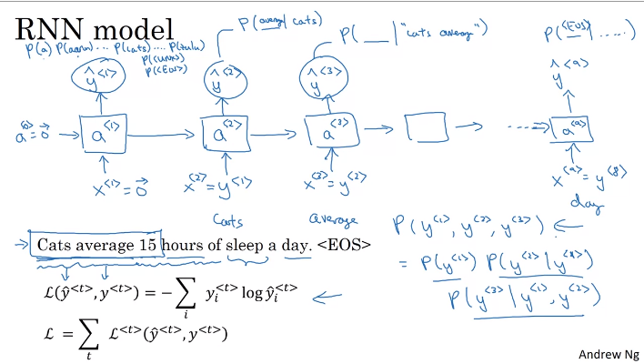

[toc]

# Why Sequence Models?

+ 활용 예시

+ 위의 예제 테이블로 정리

| 활용        | X Sequence 여부              | Y Sequence 여부 |
| ----------- | ---------------------------- | --------------- |
| 음성 인식   | O                            | O               |
| 음악 생성   | 정수, 공집합, 처음 몇개 음절 | O               |
| 감성 분석   | O                            | 정수            |
| DNA 분석    | O                            | O               |
| 기계 번역   | O                            | O               |
| 비디오 인식 | O                            | X               |
| 개체명 인식 | O                            | O               |

# Different Types of RNNs

+ one-to-one

  + 일반적인 신경망

+ One-to-Many

  +  음악 생성

+ Many-to-one

  + 감성 분석, Rating

+ Many-to-Many

  + with same lengths of X and Y
  + 기계 번역 (with difference lengths of X and Y)
    + encoder - decoder 구조

  

# Language Model and Sequence Generation

> **학습내용**
>
> + RNN을 이용한 언어모델 구현
>   + 주말의 연습으로 이어짐

## What is language modeling

+ 언어모델의 역할

  

  + 어떤 문장이 주어지든 그 특정한 문장의 확률이 얼마인지를 알려주는 것
    + 단어의 특정 시퀀스의 확률을 추정하는 것

## Language modeling with an RNN

1. 문장을 Tokenize 하기
   + 단어들을 Corpus에 매핑
   + Corpus에 존재하지 않는 단어의 경우 UNK 토큰에 매핑
   + 문장의 끝을 나타내는 EOS 토큰 사용 (옵션)
   + 구두점도 토큰으로 사용하기 원하면 사용가능 (옵션)

2. RNN Model 빌드

   + 단계 1 : 처음에는 일부 $a_1$을 일부 input $x^{<1>}$의 함수로서 계산. 그리고 $x^{<1>}$은 그냥 0벡터로만 설정. 관례상 이전 $a_0$도 0벡터로 설정. 하지만 $a_1$는 소프트맥스 예측을 만들어 첫 번째 단어 $y^{<1>}$의 확률을 파악하려 할 것이고 이게 $\hat{y}^{<1>}$이 됨. 이 단계에서는 소프트맥스로 딕셔너리의 아무 단어의 확률을 예측하려는 것.
   + 단계 2 :  RNN은 다음 단계로 나아가고 이 단계의 목적은 두 번째 단어가 무엇인지 확률을 계산하는 것.  첫 번째 단어는 사실 cats 이였으며,  $y^{<1>}$ = cats일 때의 조건부 확률을 계산. 그래서 이것이 $y^{<1>}$이 $x^{<2>}$와 동일한 이유.
   
   

# Sampling a sequence from a trained RNN

> **학습내용**
>
> + 훈련된 RNN 언어 모델로부터 문장을 생성하는 방법

+  언제까지 문장을 생성할 것인가?

  + EOS 를 어휘에 포함시킨다면, EOS가 나올 때까지 샘플링 가능

  + 그렇지 않다면, 단어의 개수를 정해서 샘플링가

+ Character-level language model
  + vocabulary = [a-Z0-9,.:"'']
  + 장점
    + 모르는 토큰을 걱정할 필요 없음 (UNK)
  + 단점
    + 단어 수준의 모델보다 더 긴 배열
    + 앞부분의 내용이 뒷부분에 영향을 주는 정도를 모델링하는 데 단어 수준의 모델보다 성능이 떨어짐
    + 단어 수준의 모델보다 훈련 비용이 비쌈
  + 활용
    + 오늘날 널리 사용되지 않음
    + 알 수 없는 단어를 많이 다룰 필요가 있는 경우 사용
    + 전문화 된 어휘를 가지고 있는 곳에서 사용

