[toc]


# Why Sequence Models?

+ 활용 예시

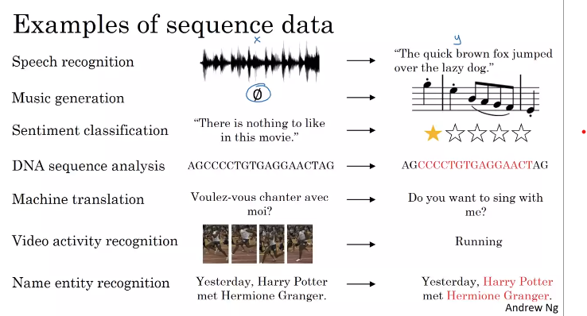

+ 위의 예제 테이블로 정리

| 활용        | X Sequence 여부              | Y Sequence 여부 |
| ----------- | ---------------------------- | --------------- |
| 음성 인식   | O                            | O               |
| 음악 생성   | 정수, 공집합, 처음 몇개 음절 | O               |
| 감성 분석   | O                            | 정수            |
| DNA 분석    | O                            | O               |
| 기계 번역   | O                            | O               |
| 비디오 인식 | O                            | X               |
| 개체명 인식 | O                            | O               |


# Different Types of RNNs

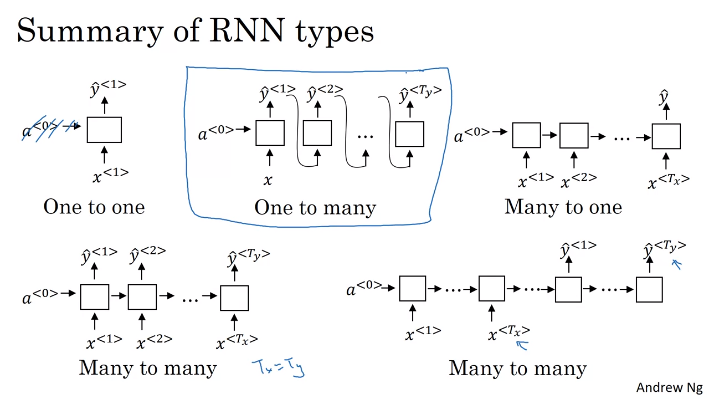

+ one-to-one

  + 일반적인 신경망

+ One-to-Many

  +  음악 생성

+ Many-to-one

  + 감성 분석, Rating

+ Many-to-Many

  + with same lengths of X and Y
  + 기계 번역 (with difference lengths of X and Y)
    + encoder - decoder 구조

  

# Language Model and Sequence Generation

> **학습내용**
>
> + RNN을 이용한 언어모델 구현
>   + 주말의 연습으로 이어짐


## What is language modeling

+ 언어모델의 역할

  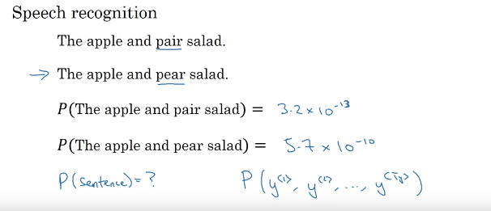

  + 어떤 문장이 주어지든 그 특정한 문장의 확률이 얼마인지를 알려주는 것
    + 단어의 특정 시퀀스의 확률을 추정하는 것


## Language modeling with an RNN

1. 문장을 Tokenize 하기
   + 단어들을 Corpus에 매핑
   + Corpus에 존재하지 않는 단어의 경우 UNK 토큰에 매핑
   + 문장의 끝을 나타내는 EOS 토큰 사용 (옵션)
   + 구두점도 토큰으로 사용하기 원하면 사용가능 (옵션)


2. RNN Model 빌드

   + 단계 1 : 처음에는 일부 $a_1$을 일부 input $x^{<1>}$의 함수로서 계산. 그리고 $x^{<1>}$은 그냥 0벡터로만 설정. 관례상 이전 $a_0$도 0벡터로 설정. 하지만 $a_1$는 소프트맥스 예측을 만들어 첫 번째 단어 $y^{<1>}$의 확률을 파악하려 할 것이고 이게 $\hat{y}^{<1>}$이 됨. 이 단계에서는 소프트맥스로 딕셔너리의 아무 단어의 확률을 예측하려는 것.
   + 단계 2 :  RNN은 다음 단계로 나아가고 이 단계의 목적은 두 번째 단어가 무엇인지 확률을 계산하는 것.  첫 번째 단어는 사실 cats 이였으며,  $y^{<1>}$ = cats일 때의 조건부 확률을 계산. 그래서 이것이 $y^{<1>}$이 $x^{<2>}$와 동일한 이유.
   
   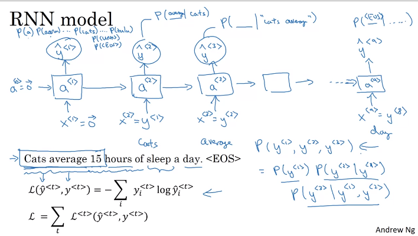


# Sampling a sequence from a trained RNN

> **학습내용**
>
> + 훈련된 RNN 언어 모델로부터 문장을 생성하는 방법


+ RNN 언어모델 Training vs. Sampling

  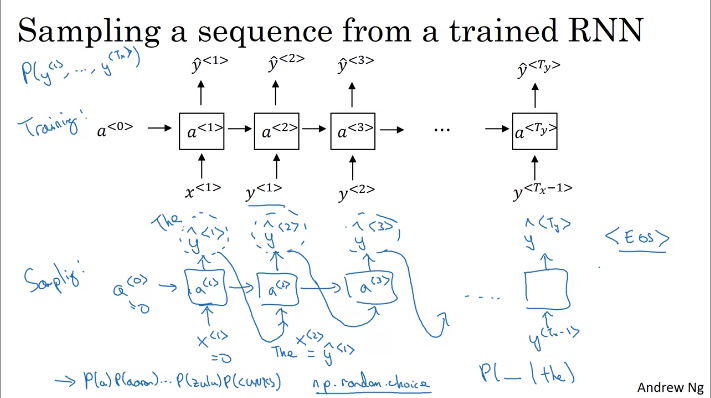

  + Training : $x_i = y_{i-1}$ 로 Training
  + Sampling : 초기 $a_0, x_0$ 를 이용하여 $\hat{y}_1$ 를 생성하고, 이의 조건부 확률을 이용하여 $\hat{y}_i$ 를 반복적으로 생성


+ 언제까지 문장을 생성할 것인가?	

  + EOS 를 어휘에 포함시킨다면, EOS가 나올 때까지 샘플링 가능

  + 그렇지 않다면, 단어의 개수를 정해서 샘플링 가능


+ [번외] Character-level language model
  + vocabulary = [a-Z0-9,.:"''] 로 문자만 사용
  + 장점
    + 모르는 토큰을 걱정할 필요 없음 (UNK)
  + 단점
    + 단어 수준의 모델보다 더 긴 배열
    + 앞부분의 내용이 뒷부분에 영향을 주는 정도를 모델링하는 데 단어 수준의 모델보다 성능이 떨어짐
    + 단어 수준의 모델보다 훈련 비용이 비쌈
  + 활용
    + 오늘날 널리 사용되지 않음
    + 알 수 없는 단어를 많이 다룰 필요가 있는 경우 사용
    + 전문화 된 어휘를 가지고 있는 곳에서 사용


# Vanishing Gradients with RNNs

> **학습내용**
>
> + RNN의 문제점인 기울기 소실과 해결방안
> + 기울기 폭발의 해결방안


+ 언어 모델의 일관성 유지가 필요함
  + 예시
    + The cat , which ..., was
    + The cats , which ..., were
  + 기울기 소실 문제
    + 역전파에서 기울기 소실 문제가 있다면 주어와 동사 사이의 길이가 매우 길어지는 경우, 모델은 단수형(복수형)인 것을 외워서 was(were)를 도출해내는 것에 어려움을 겪음
      + RNN 역시 기울기 소실 문제를 가지고 있음
      + RNN은 장거리 의존성 파악에 어려움을 겪음
    + 해결방법 (여러 방법들이 필요함)
      + GRU (Gated Recurrent Unit) : 기울기 소실을 완화하고 더욱 장거리의 의존성을 포착하도록 해줌
  + 기울기 폭발 문제
    + 매개변수의 값이 매우 커지므로 포착하기 쉬움
    + 해결방법
      + 그래디언트 클래핑을 통해 값을 제한시


# GRU and LSTM

## Gated Recurrent Unit (GRU)

> **학습내용**
>
> + 기울기 소실 문제를 해결하기 위한 GRU의 아이디어와 모델 구성


+ RNN unit

+ GRU unit (Simple version)

  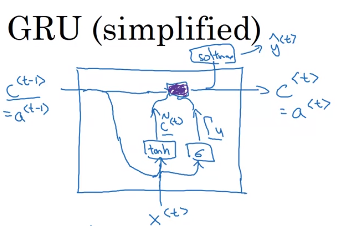

  + 기울기 소실의 문제를 해결하기 위해 RNN의 hidden layer를 수정
  + c(memory cell)와 a가 같음 (LSTM에서는 다름)
  + $\tilde{c}_t$ 는 $c_t$ 의 대체후보가 됨
  + GRU의 핵심 아이디어는 Update Gate를 가지는 것 : $\Gamma_u$ : 0 ~ 1 사이값
  + 두 번째 핵심아이디어는 Update Gate $\Gamma_u$ 가 $c_t$를 $\tilde{c}_t$ 로 업데이트 시킬지 정하는 것


+ GRU unit (Full version : $\Gamma_r$ 추가됨)

  + $\tilde{c}^{<t>}=\tanh \left(W_c\left[c^{<t-1>}, x^{<t>}\right]+b_c\right)$ $\overset{게이트 1개 추가}{\rightarrow} \tilde{c}^{<t>}=\tanh \left(W_c\left[\Gamma_r *c^{<t-1>}, x^{<t>}\right]+b_c\right)$
    + $r$은 relevance (적절성)을 뜻하고, $\Gamma_r$은  $c^{<t-1>} $이 $\tilde{c}^{<t>}$ 를 계산하는 데 얼마나 적합한지를 나타냄
    + $\Gamma_r$ 을 추가한 이유는 장거리의존성을 모델링하고 기울기 소실문제를 해결하기 위한 여러 시도의 결과

  + $\Gamma_u=\sigma\left(W_u\left[c^{<t-1>}, x^{<t>}\right]+b_u\right)$
  + $\Gamma_r=\sigma\left(W_r\left[c^{<t-1>}, x^{<t>}\right]+b_r\right)$

  + $c^{<t>}=\Gamma_u * \tilde{c}^{<t>}+\left(1-\Gamma_u\right) * c^{<t-1>}$
  + $a^{<t>} = c^{<t>}$


+ GRU 의미
  + RNN에 장거리 의존성을 포착하기 위한 아이디어가 추가된 것
    + memory cell 추가
    + memory cell Update를 위한 Gate 추가


## LSTM

> **학습내용**
>
> + 기울기 소실 문제를 해결하기 위한 LSTM의 아이디어와 모델 구성


+ LSTM이 GRU와 다른점
  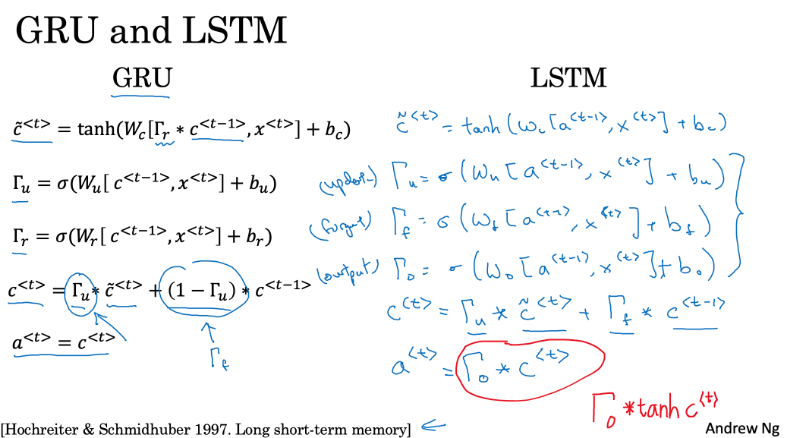

  + $a^{<t>} \neq c^{<t>}$

  + $\Gamma_r$ (relevance gate) 사용하지 않음

  + $1-\Gamma_u$ 대신에 $\Gamma_f$ Gate를 사용

    

+ LSTM

  + $\begin{aligned} & \tilde{c}^{<t>}=\tanh \left(W_c\left[a^{<t-1>}, x^{<t>}\right]+b_c\right) \\ & \Gamma_u=\sigma\left(W_u\left[a^{<t-1>}, x^{<t>}\right]+b_u\right) \\ & \Gamma_f=\sigma\left(W_f\left[a^{<t-1>}, x^{<t>}\right]+b_f\right) \\ & \Gamma_o=\sigma\left(W_o\left[a^{<t-1>}, x^{<t>}\right]+b_o\right) \\ & c^{<t>}=\Gamma_u * \tilde{c}^{<t>}+\Gamma_f * c^{<t-1>} \\ & a^{<t>}=\Gamma_o * \tanh c^{<t>}\end{aligned}$

    

  + 다이어그램

    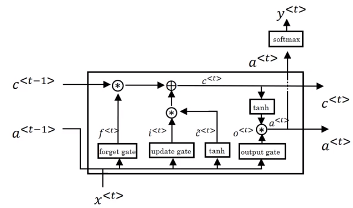

    + ​	모든 게이트와 tanh에 $a^{<t-1>}, x^{<t>}$ 가 input으로 들어감

    

    + 상단의 update gate를 보면 $c^{<3>} = c^{<0>}$ 를 얻기 위해 오른쪽으로 전달하기 쉬움
      + LSTM이 특정 값을 암기하는데 매우 뛰어난 이유


+ LSTM의 변형
  + peophole connection 사용
    + Gate 값 $\Gamma_u, \Gamma_f, \Gamma_o$ 계산시 $a^{<t-1>}, x^{<t>}$뿐 아니라 $ c^{<t-1>}$ 도 사용하는 것


## GRU and LSTM

+ 보편적으로 더 우월한 알고리즘은 없음
+ GRU의 장점은 단순한 모델이라는 것
  + 두 개의 게이트로 더 큰 네트워크를 빌드하기 쉬움
  + 계산도 더 빠름
+ LSTM의 장점은 더 파워풀하고, 게이트가 3개이므로 더 유연하다는 것
+ 역사적으로 LSTM이 좀 더 검증되었기 때문에, LSTM을 더 많이 사용함


# Bidirectional RNN

> **학습목표**
>
> + RNN을 더 강력하게 하는 아이디어 2개 중 1개인 Bidirectional RNN 학습
>   + GRU와 LSTM 역시 순방향 네트워크이고, Bidirection을 결합하여 사용할 수 있음


+ RNN의 한계점 예시(개체명인식)

  ```
  He said, "Teddy bears are on sale!"
  He said, "Teddy Roosevelt was a great President!"
  ```

  + 위 두 문장에서 첫 3단어를 통해 Teddy가 사람이름인지 아닌지 알 수 없음

  + 순방향 RNN 모델 구조

    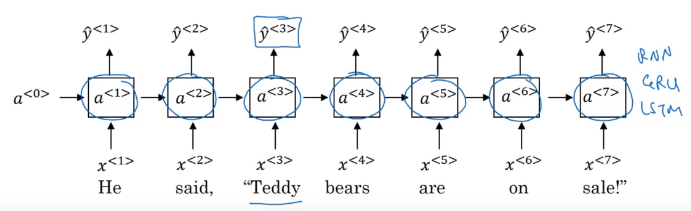

+ BRNN 구조

  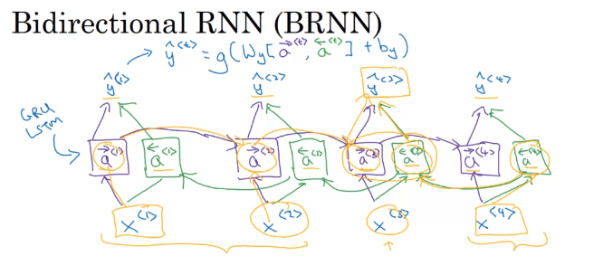

  + 예를들어 $\hat{y}^{<3>}$ 을 구하기위해
    + 정방향 $x^{<1>}, x^{<2>}, x^{<3>}$ 이 고려되고, 
    + 역방향 $x^{<4>}, x^{<3>}$ 가 고려됨
  + 따라서 Teddy가 사람이름(개체명)인지 알기위해 Roosevelt 도 활용하게 


+ BRNN 활용
  + 많은 NLP문제에서 LSTM이 있는 BRNN이 일반적으로 사용
  + 전체 시퀀스 데이터를 얻을 수 있는 NLP문제에서 효과적
+ BRNN 단점
  + 예측하기 전에 전체 데이터 시퀀스가 필요
    + 예를들어 음성인식 모델에 활용한다면, 사람이 말하기를 멈추는 것을 기다려야 함 -> 이를 해결하기 위해 실제 음성인식 모델은 좀 더 복잡


# Deep RNN

> **학습목표**
>
> + RNN을 더 강력하게 하는 아이디어 2개 중 1개인 Deep RNN 학습
>   + 매우 복잡한 기능을 학습하는 경우 RNN, GRU, LSTM, BRNN 의 여러 계층을 함께 쌓아 심층 버전을 구축하는 것이 더 유용함


+ Deep RNN 구조

  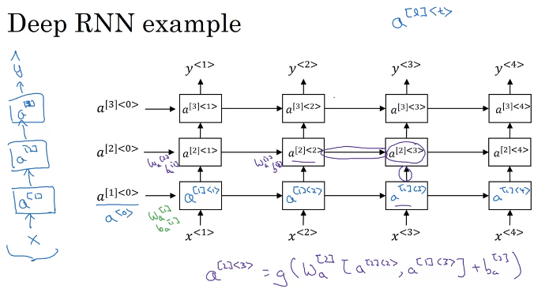

  + $a^{[layer]<time>}$  형식의 index를 사용함

  + 각 가로 layer 마다 $W, b$는 동일

  + 가로 layer를 horizontal connections, 세로 layer를 deep network

  + 가로 layer를 많이 쌓지 않음(시간을 고려하기 때문에 계산량이 많음)

  + 블록으로 RNN, GRU, LSTM, BRNN  모두 사용 가능

    

+ Deep RNN 변형 구조 (deep network를 더 깊게함)

  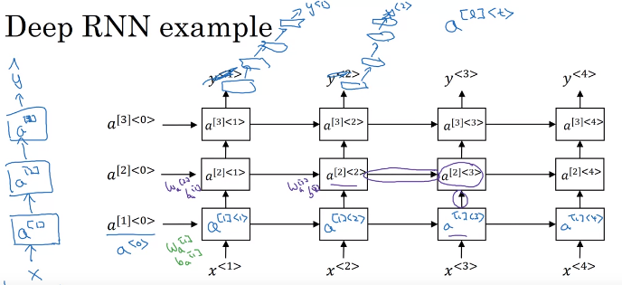
