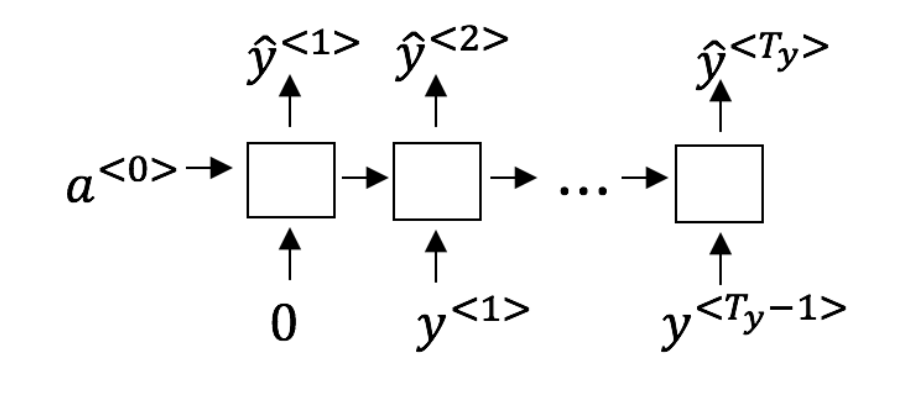
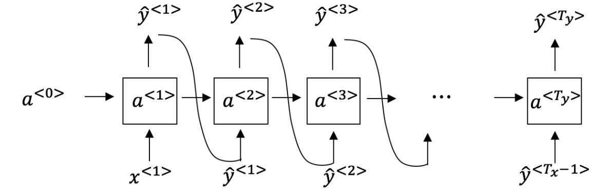
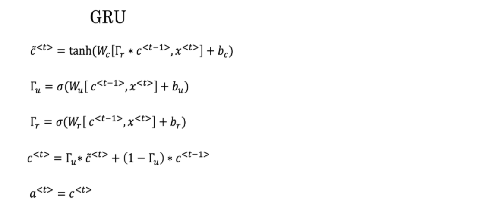
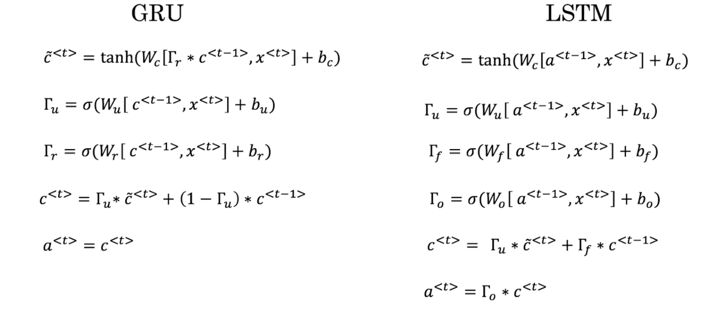

# Recurrent Neural Networks

1. Suppose your training examples are sentences (sequences of words). Which of the following refers to the jth word in the ith training example?

  - [x] x(i)\<j> 
  - [ ] x\<i>(j) 
  - [ ] x(j)\<i> 
  - [ ] x\<j>(i) 

2. Consider this RNN:
  
  True/False : This specific type of architecture is appropriate when $T_x > T_y$  

  - [x] True
  - [ ] False

3. To which of these tasks would you apply a many-to-one RNN architecture?
    

  - [ ] Image classification (input an image and output a label)

  - [x] Music genre recognition

  - [x] Language recognition from speech (input an audio clip and output a label indicating the language being spoken)

  - [ ] Speech recognition (input an audio clip and output a transcript)

    

4. Using this as the training model below, answer the follwing:
  
  At the tth time step, what is the RNN doing? Choose the best answer.  

  - [ ] Estimating P(y\<1>, y\<2>, ...., y\<t-1>)
  - [ ] Estimating P(y\<1>)
  - [x] Estimating P(y\<t> | y\<1>, y\<2>, ...., y\<t-1>)
  - [ ] Estimating P(y\<t> | y\<1>, y\<2>, ...., y\<t>)

  

5. You have finished training a language model RNN and are using it to sample random sentences, as follows:
  
  What are you doing at each time step t?

  - [ ] (i) Use the probabilities output by the RNN to pick the highest probability word for that time-step as $\hat{y}^{<t>}$. (ii) Then pass the ground-truth word from the training set to the next time-step.
  - [ ] (i) Use the probabilities output by the RNN to randomly sample a chosen word for that time-step as  $\hat{y}^{<t>}$.  (ii) Then pass the ground-truth word from the training set to the next time-step.
  - [ ] (i) Use the probabilities output by the RNN to pick the highest probability word for that time-step as  $\hat{y}^{<t>}$. (ii) Then pass this selected word to the next time-step.
  - [x] (i) Use the probabilities output by the RNN to randomly sample a chosen word for that time-step as  $\hat{y}^{<t>}$. (ii) Then pass this selected word to the next time-step.

6. True/False : If you are training an RNN model, and find that your weights and activations are all taking on the value of NaN then you have a vanishing gradient problem
   1. [ ] True
   2. [x] False (True : Exploding gradient)

7. Suppose you are training a LSTM. You have a 50000 word vocabulary, and are using an LSTM with 500-dimensional activations a\<t>. What is the dimension of Γu at each time step?

   - [ ] 5

   - [x] 500

   - [ ] 50000

   - [ ] 200

   sol) $\Gamma_u$ 의 차원은 activation의 차원과 같음

   

8. GRU에서 Gradient Vanishing을 줄이기 위해 둘 중 어떤 것이 더 효과적인가?

   

   1. $\Gamma_u = 0$
      +  새로운 정보를 반영하지 않고, 현재 상태는 이전 상태와 완전히 동일하게 됨

   2. $\Gamma_r=1$
      + 이전 상태의 모든 정보가 현재 상태의 후보에 반영됨 -> 업데이트 게이트의 값에 따라 Gradient Vanishing 문제 발생 가능

   + sol)
     + For the signal to backpropagate without vanishing, we need $c^{<t>}$ to be highly dependent on $c^{<t-1>}$. so, 1. is answer

   
   

9. GRU의 $1-\Gamma_u$ 와 LSTM에서 대응되는 것은?

   

   + sol)  $\Gamma_f$ : Forget Gate

10. True/False : You would use undirectional RNN if you were building a model map to show how your mood is heavily dependent on the current and past few days' weather.

    - [x] True
    - [ ] False

    sol) Your mood is contingent on the current and past few days' weather, not on the current, past, AND future days' weather.