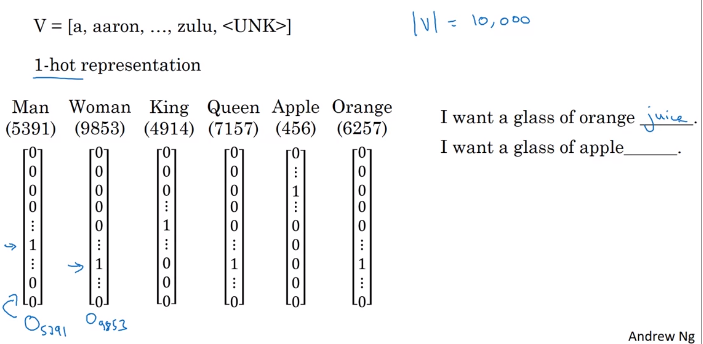
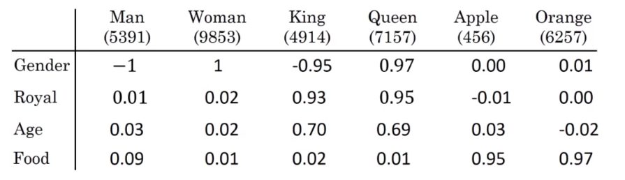
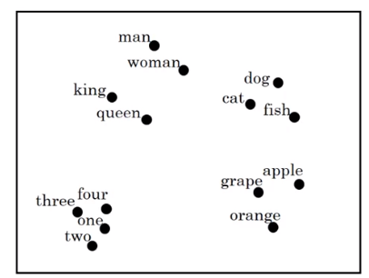

[toc]

# 주차 목표

+ RNN, GRU, LSTM 를 NLP에 적용하기
+ Explain how word embeddings capture relationships between words
+ Load pre-trained word vectors
+ Measure similarity between word vectors using cosine similarity
+ Use word embeddings to solve word analogy problems such as Man is to Woman as King is to \_\_\_\_\_\_.
+ 단어 임베딩에서 편향 제거하기 (Reduce bias in word embeddings)
+ Create an embedding layer in Keras with pre-trained word vectors
+ Describe how negative sampling learns word vectors more efficiently than other methods
+ Explain the advantages and disadvantages of the GloVe algorithm
+ Build a sentiment classifier using word embeddings
+ Build and train a more sophisticated classifier using an LSTM

# 1. Introduction to Word Embeddings

## 1.1. Word Representation

### 1.1.1.One-Hot Representation

+ 원-핫 벡터의 단점

  + 각 단어를 하나의 개체로 여기고 단어 간의 관계가 모두 똑같기 때문에, cross word를 일반화하기 쉽지 않음

    + cross word를 일반화하지 못하는 예시

      

      + I want a glass of orange juice 를 모델이 학습했지만, I want a glass of apple \_\_\_\_\_ . 를 풀지 못함 ( 이유는 Orange와 Apple의 관계가 Orange와 King과의 관계보다 가깝다는 것을 알지 못함 = 내적값이 0임 )
      + 남자 : 여자 = 왕 : ? 를 풀지 못함

### 1.1.2. Featurized Representation : Word Embedding

>  **Word Embedding 사용이유**
>
>  + 원-핫 벡터의 단점을 극복하여
>
>    1. 서로 가까운 단어가 어떤 단어인지 알 수 있고
>
>    2. 서로 비슷한 관계의 단어가 무엇인지 알 수 있음

+ 임베딩 예시

  

  + 위 도표의 시각화 표현

    

  + 위와 같은 임베딩의 결과로, 단어 간의 관계를 파악할 수 있게 됨

    + Man $\simeq$ Woman, King $\simeq$ Queen, Apple $\simeq$ Orange
    + 따라서, I want a glass of orange juice 를 모델이 학습하면, I want a glass of apple \_\_\_\_\_ . 를 풀수 있음.

  + 위와 같이 2D로 나타내기 위해 t-SNE 알고리즘을 많이 사용

    

​	
