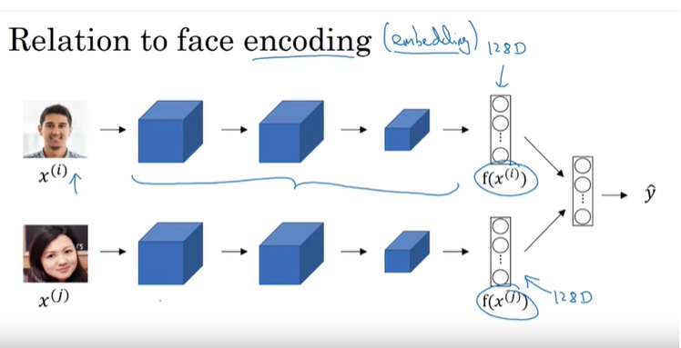
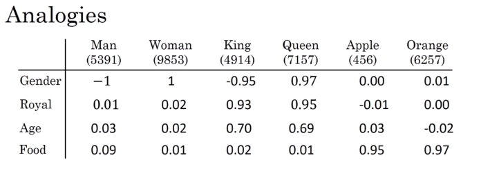
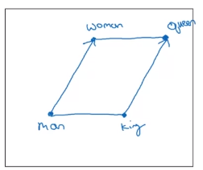

[toc]

# 주차 목표

+ RNN, GRU, LSTM 를 NLP에 적용하기
+ Explain how word embeddings capture relationships between words
+ Load pre-trained word vectors
+ Measure similarity between word vectors using cosine similarity
+ Use word embeddings to solve word analogy problems such as Man is to Woman as King is to \_\_\_\_\_\_.
+ 단어 임베딩에서 편향 제거하기 (Reduce bias in word embeddings)
+ Create an embedding layer in Keras with pre-trained word vectors
+ Describe how negative sampling learns word vectors more efficiently than other methods
+ Explain the advantages and disadvantages of the GloVe algorithm
+ Build a sentiment classifier using word embeddings
+ Build and train a more sophisticated classifier using an LSTM

# 1. Introduction to Word Embeddings

## 1.1. Word Representation

### 1.1.1.One-Hot Representation

+ 원-핫 벡터의 단점

  + 각 단어를 하나의 개체로 여기고 단어 간의 관계가 모두 똑같기 때문에, cross word를 일반화하기 쉽지 않음

    + cross word를 일반화하지 못하는 예시

      

      + I want a glass of orange juice 를 모델이 학습했지만, I want a glass of apple \_\_\_\_\_ . 를 풀지 못함 ( 이유는 Orange와 Apple의 관계가 Orange와 King과의 관계보다 가깝다는 것을 알지 못함 = 내적값이 0임 )
      + 남자 : 여자 = 왕 : ? 를 풀지 못함

### 1.1.2. Featurized Representation : Word Embedding

>  **Word Embedding 사용이유**
>
>  + 원-핫 벡터의 단점을 극복하여
>
>    1. 서로 가까운 단어가 어떤 단어인지 알 수 있고
>
>    2. 서로 비슷한 관계의 단어가 무엇인지 알 수 있음

+ 임베딩 예시

  

  + 위 도표의 시각화 표현

    

  + 위와 같은 임베딩의 결과로, 단어 간의 관계를 파악할 수 있게 됨

    + Man $\simeq$ Woman, King $\simeq$ Queen, Apple $\simeq$ Orange
    + 따라서, I want a glass of orange juice 를 모델이 학습하면, I want a glass of apple \_\_\_\_\_ . 를 풀수 있음.

  + 위와 같이 2D로 나타내기 위해 t-SNE 알고리즘을 많이 사용

    

​	

## 1.2. Using Word Embedding

> **학습목표**
>
> + Featured Representation을 NLP에서 활용하는 방법

### Word Embedding의 장점과 활용

+ Named Entity Recognition Example

    + 수행하려는 NLP작업의 훈련 데이터 크기가 작은 경우에 유용하다. 그 이유는 Word Embedding을 통한 Transfer learning이 가능하기 때문이다.

    + 라벨이 없는 수많은 단어를 학습하여, 단어들의 관계를 학습하고 $\rightarrow $ 이를 Name Entity Recognition에 전달할 수 있음(Transfer learning) $ \rightarrow $  Vocab의 수를 줄일 수 있음

        + 예) Orange와 Durian, Farmer와 Cultivator가 비슷한 것임을 학습할 수 있음

            

+ **Word Embedding을 통한 Transfer learning 과정**

    > 1의 데이터 셋(For Word Embedding)이 크고, 2의 데이터 셋(For NLP)이 상대적으로 더 작을수록 유용함

    1. Learn word embeddings from large text corpus (1-100B words) 

        (or Download pre-trained embedding online)

    2. Transfer embedding to new task with smaller  trianing set (100k words)

        + 상대적으로 저차원의 Feature Vector를 사용할 수 있게 됨

    3. Optional : Continue to finetune the word embeddings with new data (2단계의 단어 개수가 매우 많은 경우에 진행)

+ 유용한 분야
    + Named Entity Recognition (개체명 인식)
    + Text summarization (문서 요약)
    + co-reference resolution (상호 참조해결: 임의의 개체(entity)를 표현하는 다양한 명사구(멘션)들을 찾아 연결)
    + parsing (구문 분석)

+ 덜 유용한 분야
    + Language modeling (언어 모델링) with large data set
    + machine translation (기계 번역) with large data set

### Word Embedding과 Face Recognition

+ 공통점
    + Embedding과 Encoding(위 그림의 $f(x^{(i)})$)은 꽤나 같은 의미
+ 차이점
    + Word Embedding : fixed Vocab에 대해서만 훈련이 진행되고, 그 밖은 <UNK> 로 훈련됨.
    + Face Recognition : train 때 보지 못한 얼굴이 들어와도 인식하도록 훈련함

## 1.3. Properties of Word Embeddings

> **학습목표**
>
> + Word Embedding이 갖는 성질인 유추성에 대한 직관파악

+ 궁금증

  + Man $\simeq$ Woman $\Rightarrow$ King $\simeq$ ? 에서 King에 대응되는 ?를 Man과 Woman의 관계를 통해서 알 수 있을까?

+ 답변

  + 있다!

  + HOW?

    1. $e_{man} - e_{woman} \simeq e_{king} - e_?$ 이므로,  $e_? \simeq e_{king} + e_{woman} - e_{man}$ 이다.

       

    2. 따라서 **$\text{argmax}_w sim(e_w, e_{king} + e_{woman} - e_{man})$** 인 임베딩 벡터 $e_w$를 찾으면 됨!
       + 논문에 의하면 이와같은 방식의 추론의 정확도(정확히 일치)가 35~70%라고 알려짐

  + 주의점

    + t-SNE와 같은 차원축소 방법으로 임베딩 벡터를 차원 축소시킨 이후에는 위와 같은 관계가 보존되지 않음

